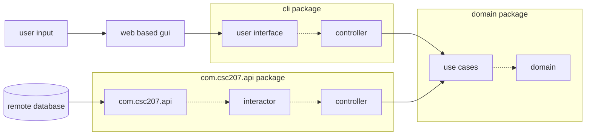

*Design Document*

## **Updated Specifications**

User opens application and either signs in with username and password if they have an account or signs up for an account if they don't have one yet

Tasks are scheduled into weeks. A week either is created by the program for the user to schedule tasks into, or retreived from the database for the user to edit if they wihs to do so and already have a week saved in the program.

The user uses the app to schedule their upcoming tasks by inputting the tasks they want to get done, and specifying details such as:

1.  The amount of time tasks will take
    
2.  When they want to complete the tasks by
    
3.  If they wish to complete the task via a series of smaller tasks
    

Tasks are separated into two types, fixed and non-fixed, based on whether they have to be completed at a certain time (e.g. meeting) or not (e.g. exercising). The user is also able to create a project (i.e. a collection of tasks). For example, if a user wants to complete an assignment that takes 20 hours to complete, then they would add a project, specifying:

1.  How many hours they want to work on the project (in this example, 20)
    
2.  What is the maximum amount of time they're willing to work on the project per day
    
3.  When they want to complete the project by
    

The program is supposed to take the non-fixed tasks, find an appropriate time for them (i.e. a time that does not coincide with the fixed tasks) such that they can be completed before the deadline, and add them to the schedule. After adding the tasks they want to complete, the user should be able to view a schedule of their week with all the fixed and non-fixed tasks they will do for the week.

**The new features in our program since phase 0:**

-   Customized error messages thrown when user enters a badly formatted date, an incorrect option out of given options, a wrong password, etc.

-   Connection to a PostgreSQL database and spring boot web application framework

-   A slightly more sophisticated scheduling algorithm which tells the user when they have no room for a task

-   Ability for the user to sign in. this feature enables: 
    -  The user to save their working week	schedule
    -  The user to access previously saved week schedules
    -  User information (i.e. username, password and ID) to be saved

    
## **Design Decisions**

**Temporary focus on backend at the cost of robust UI:** we felt that it would be too much to work on both the com.csc207.api and web stuff simultaneously, both of which are new areas of software we have never learned about or implemented before. Since phase 1 requires data serialization and spring offers us the opportunity to do so in a way that is conducive to a web application, we spent our time developing the com.csc207.api and back end, but hope to utilize this framework to develop a robust front end over the next few weeks for phase 2.

**Choice to proceed with a web application:** We chose to build a web application over Springboot because some of our team members have experience with HTML and CSS and wanted to deepen their experience. Our other team members find this knowledge base to be useful. We think a web app would be beneficial for our user since it allows them to access the app from a wider range of devices. Calendars stay constant but users change location, and we want to meet this need.

**Choice of PostgreSQL:** We chose PostgreSQL as our databse since it was the database used in the course provided video tutorial and we thought we could take advantage of its ability to store arrays. This special feature ended up being unncessary as we just linked tables to each other (see other desing decisions for more info).

**Choice of which entities to write to database:** We chose to store data in our database using three tables: Tasks (to store TaskSerializable object data), Weeks (to store WeekSerializable object data), and Users (to store User object data). We made this choice because this is the minimum amount of stored info our program needs to have complete data persistence. We need to be able to keep track of a Week object associated with a User object. However, a Week object contains Task objects inside of it, and PostgreSQL databases cannot store "nested tables". Thus, we needed a seperate table for serializing Task objects, which keeps track of the date they are to be completed on and the User who created them, both of which are linked to the WeekSerializable objects stored in the Week table via their data and the id of the user who scheduled them. To elaborate, if a given Task's date is contained within the seven day span starting on a given Week's start date and the Task's user id matches that of the Week, then we know the given Task is contained inside the given Week and have all the information necessary to reconstruct this week for the user. The users are stored in their own table.

**Choice to write info to database at 2 points:**

-   Store user when they sign in: we wanted to commit the user to the database as soon as they connect to the program so that the database can assign them a user ID that goes into each of the tasks they create. This way, the program keeps track of which activity belongs to the user as the tasks are created and scheduled.  
      
    
-   Store week when user exits program: we thought this would be an effective point to store the week since the user would have put all the information they need into that week and are done with it until they revisit the program. We considered storing each of the entities into the database as they are instantiated by the user, but decided to simplify our use of the database while we are still learning how to use it. We can potentially complicate our database use going into phase 2 if we wish to make the database more responsible for the user’s info as they go through the program. An advantage of this approach is that if the program crashes, the user will not lose their schedule for the week they are in the process of editing. However, we feel that our current setup is sufficent for storing user info and being able to recall it when the user revisits the program.
    

  

**Converted todaySchedule from Hashmap to LinkedHashmap:** In phase 0 we stored the schedule of a day as a Hashmap where each key (time) was linked to a task name. However since HashMap did not preserve insertion order, the Hashmap did not display time in the correct order. After some investigation, we have decided to change the hashmap into a Linkedhashmap that iterates in the order in which the entries were put into the map. This will allow the schedule keys to correspond to the times of day in the proper order.

**Added a list of tasks as an attribute to each Day object:** We added a list of tasks as an attribute to each day object in order to keep track of the tasks that are associated with a given day. Previously, when the day object did not have this attribute, there was no way of checking the exact task objects that were in the day object because the day object’s todaySchedule attribute maps the time to the name of the task (and does not keep track of any of the other attributes). This meant that we were not keeping track of task attributes other than name and time at which they were scheduled once we scheuled the tasks. With the list of tasks, it allows us to access the specific task objects that are added into the day by looking for common names between the task object and the task in the todaySchedule. The task list also plays an important role in allowing us to write scheudles to the databse.

**Choice of Exceptions:**

-   Exception INVALID_DATE_FORMAT. We decided to include this exception in order to help the user realize when they have entered a date in a format that is unrecognized by the program, this exception tells the user that the format of the date must be changed.
    

  

-   Exception SCHEDULE_CONFLICT. We decided to include this exception in order to account for a situation where the user would like to schedule a task, but the task has a conflicting time with another task.
    

  

-   Exception INVALID_TIME_FORMAT. We decided to include this exception in order to help the user realize when they have entered a time in a format that is unrecognized by the program, this exception tells the user that the format of the time must be changed.
    

**Improving Scheduling Algorithm**

In phase 0 our group designed a scheduling algorithm that is capable of scheduling a task/project into an empty week. To make our scheduling algorithm more applicable to real-life scenarios where a user needs to schedule multiple tasks/projects into a week, we realized that several improvements need to be made to our scheduling algorithm:

  

1.  The program should be able to inform the user when a task/project can’t be scheduled due to task overlap/lack of time
    
2.  When a task/project can’t be scheduled the user should be given the choice to either give up scheduling the current task or modify their schedule so that the current task can be scheduled
    
3.  If the user decides to continue scheduling the current task, our program should provide the user with the minimum number of hours he/she needs to remove from the current taskload to schedule the current task.
    
4.  The user should be allowed to remove a task or change the duration of a task
    

  

To accomplish 1 we have added a new use case class called Checker that checks if a task/project can be scheduled in a week. For FixedTasks, Checker implements a method called CheckScheduleFixedTask that checks if a task overlap would occur once the user schedules the current FixedTask. As for NonFixedTask and projects, Checker checks if the user has enough time in the week to work on the NonFixedTask/project. In phase 2 we will continue to work on 2, 3, and 4.

  

**Use of GitHub Features**

Our group utilized GitHub Features including pull request and branching. We created different branches so that our team could work on different tasks at the time and try implementing new features without interfering with our original code. When we had changes that we were uncertain how they would affect the master branch once they were pushed, one member would also create a branch of current code as insurance. We have also utilized branches to contain new features that are in progress but not complete enough to let the master branch run smoothly. For example, in the Composite branch of our repository we have saved a version of our code with a partially implemented Composite design pattern. Moreover, each member of our team was required to leave a detailed message when changes were pushed to our repository so that other members could be informed of the changes and decide whether to accept the changes.

  

**Refactoring:**

Our group made use of built-in refactoring features in IntelliJ in order to extract helper methods, rename classes and methods, and refactor modules when switching packages so intelliJ would take care of import statements.

Another way in which we refactored our code was in our attempt to remove smells. We extracted duplicate code into helper methods, removed unnecessary classes, cut down long methods, and cut out dead code. 

There are some instances where we are worrid that we may be violating the smell of long classes. These are addressed in our questions below (e.g. splitting user interface). We realize that some of the methods in scheduler and putter are on the longer side, but we hope to split these up as we create a more complex and flexible scheduling algorithm for phase 2.

We are unsure if FixedTask and NonfixedTask count as alternative classes with different interfaces. We think not, so we left it, but we can take care of it if necessary.

Instead of having multiple scanners in the UI, we decided to only have one scanner in the main module. This took care of many of our errors and, we think, is a much neater way to take care of processing user input.

  

**Clean Architecture:**

The back end comes in sets of classes to ensure that we maintain clean architecture. For each entity type that is written to the database there is a use case class whose name ends with interactor, a controller class, and a gateway class to the database whose name ends with repository. The use case classes modify the entity so that it can be written to the database, the repository classes contain the method for writing to the database, and the controller classes connect the two.

The clean architecture from the phase 0 code is more or less the same. We still have the same issue with the project module in that we are not sure if it is one or more use cases or interfaces. One of the things we hope to do in the next phase is redesign project in a way that allows for more flexible scheduling and fixes this clean architecture issue (see open-ended questions below for more information).

Another potential violation is that the UserInterface class calls on some methods in interactor classes. We are unsure if it counts as a violation if the UI calls on a use-case without first calling a controller (e.g. signIn method). We felt that it could be fine because our dependencies go in the correct direction, but would appreciate feedback.

**SOLID Principles:**

Single responsibility principle:
We made sure that our project is consistent with the Single Responsibility Principle by creating classes such as scheduler (that attempts to schedule a task) and checker (that checks if a task can be scheduled) that each have a single responsibility, instead of making the methods for each in one big class. We had difficulty replicating that for UserInterface and Controller, since we did not know how to split up the methods. We moved the exceptions for the UI into a separate class in order to not violate single-responsibility principle.

Open/closed principle:
A good example of us adhering to that principle is in our use of the adapter design pattern. This design pattern allowed us to make our code compatible with databases without completely modifying the structure and implementation of all our entities and use cases. Thus, we kept with the Open/Close Design Principle: that our code is closed for modification but open for extension. We extended our code by adding classes compatible with newly introduced requirements for our program, rather than completely modifying all our classes. One example of where we did not do a great job adhering to this principle is in our scheduler module where we might have to change the methods in Scheduler if we proceed with implementing the composite design pattern, which changes the way tasks and projects are scheduled. We are also not too atisfied with the outcome of our current scheduling algorithm so may modify it significantly.

Liskov substitution principle:
We followed the Liskov Substitution principle by making FixedTask and NonFixedTask extend the behaviors of Task, without modifying or removing them. 

Interface segregation principle:
When it came to the interface segregation principle, we struggled. We did not know how to split up the methods in the Project interface, which resulted in many classes implementing it without using all its methods. See our open ended questions and clean architecture sections for further discussion on this topic.

Dependency inversion:
We followed the dependency inversion principle by ensuring that classes such as scheduler and checker depended on the abstractions of classes such FixedTask and NonFixedTask instead of their details. Satisfying the dependency inversion principle is a big part of our clean architecture related discussion. Even when we skipped 'layers', we always ensured that dependencies are inward and not outward.

**Packaging strategies:**

Our original packaging strategy was having three packages in our src/main/java. (1) an com.csc207.api package containing all of our database repository classes, interactor classes, and controllers; (2) a domain class containing all our entities and use cases; and (3) a cli package containing all of our front end command line classes and their respective controllers. We chose this packaging strategy (loosely termed inside/outside) because it neatly compartmentalizes different functionalities as well as compatibilities within our software. Our domain package would interact with both the cli and com.csc207.api packages, while the com.csc207.api and cli only interact with the domain. Additionally, this packaging strategy would also prep our code for scaling into a full-stack web app equipped with a web-based GUI and remote database server, since we already have pre-prepared the different packages which will interact with the newly added components. Our web-based GUI would only interact with the cli package and our remote database server would only interact with the com.csc207.api package. This would keep with both the interface segregation principle and the single repsponsibility principle, as well as provide us with an overall cleaner software structure. Below is a diagram of our packaging strategy which visually demonstrates its cleanliness and practicality:

However, with this packaging strategy, our application was not compiling due to errors SpringBoot was throwing. After much research, we discovered that SpringBoot’s entity scan (finding entities in code and matching ) only works when one of two packaging strategies is implemented: the SpringBoot default packaging strategy, or having all JPA-annotated classes within the same package. Since we did not follow SpringBoot’s default packaging strategy and did not want to start a new SpringBoot project (which would require setting all the application.properties anew and connecting the new application to the PostgreSQL database) we decided to put all of our JPA-annotated classes in the same package: the com.csc207.api package. We hope to find a way to use our original thought out design strategy (see open ended questions)

  

**Design patterns:**

We thought that builder would be a good implementation for project, but then realized that despite being a complex aggregate, project only has one version. Builder pattern is suited for complex aggregates with multiple versions.

We hope that composite pattern will help us build a more flexible version of projects and have created the classes that will allow us to do so but have not had time to implement them and adapt our scheduling and putting algorithms. These empty classes are kept on a branch named composite design pattern until they are implemented and read to merge with the master branch.

The design pattern that is currently fully implemented is the adapter pattern:

The problem: In order to have data serialization in our program, Week objects have to be saved to our database. However, week projects are complex: they have a list of Day objects as an attribute, and each of those Day objects contains a list of Task objects inside of it. Since databases cannot contain nested tables, Week objects cannot be directly saved to a database.

The possible solutions: There are two solutions to this problem. Solution 1: completely change the implementation of the Week and Task entity classes to contain only “simple” attributes and link their tables by date and user id (see subsection “Design Decisions - Database Structure Design Decision” for more info on this), and delete the Day entity class. Solution 2: create serializable versions of Task and Week (with “simple” attributes only), linking them using the user id and date fields, and save these to the database using their corresponding tables. Solution 1, while cleaner and more aligned with proper database usage, would require us to completely alter all of our entities, use case methods, controllers, and even our user interface, since our whole program depends on the structure of our Week entity. Solution 2, on the contrary, would require us only to create a couple of classes and a converter which converts between the serializable versions of the entities and the non-serializable ones.

Our solution: Solution 2, explained above, completely describes the adapter design pattern. The design pattern consists of a client that requires one form of an object while the general program uses a different form of the object which is incompatible with the client. The design pattern solves this discrepancy by having an adapter class which adapts one form of the object to another form, preparing it for use by the client. This is the design pattern we chose to use.

How the design pattern fits in with our program: Applying the pattern to our program, we created a WeekSerializable entity and a TaskSerializable entity, which are versions of Week objects and Task objects which the database (the “client”) is able to work with. We created an adapter class, WeekAndSerializableConverter, which converts Week objects and Task objects to and from their respective serializable forms. One difference our implementation of the design pattern had from the general skeleton of the design pattern is that since a Week object contains tasks inside of it, for the adaptor class to build a week, it needs both a WeekSerialzable and the TaskSerializables associated with that WeekSerializable. In other words, the adaptor does not adapt a Week to WeekSerializable and vice versa directly; rather, it contains methods to convert a Week to both WeekSerializables and TaskSerializables and to convert a WeekSerializable and TaskSerializables to a Week object.

Advantage of this apporoach - SOLID: This design pattern allowed us to make our code compatible with databases without completely modifying the structure and implementation of all our entities and use cases. Thus, we kept with the Open/Close Design Principle: that our code is closed for modification but open for extension. We extended our code by adding classes compatible with newly introduced requirements for our program, rather than completely modifying all our classes.

## Progress report:

**Open questions**
    

-   UserInterfacePrints is a collection of helper methods for the UserInerface. Typically helper methods are private and so must be in the same module as the method calling on them, but we felt that this makes the UI too crowded. We are wondering how to handle this scenario.
    
-   We are wondering if we should break up our UI and controller into multiple smaller components to avoid violating the single responsibility principle. See the SOLID section of the design document for further discussion.
    
-   We are having a lot of difficulty with packaging strategy, especially since Spring seems to be quite picky about it. See packaging strategy section of design document
    
-   We are uncertain what we are going to do about the module which is currently a project Interface. Based on the needs of our improved scheduling algorithm and our ability to implement the composite design pattern, we hope to better divide this module into multiple interfaces and classes (see clean architecture section)
    
-   We are unsure if FixedTask and NonfixedTask count as alternative classes with different interfaces (see refactoring section)
    

**What has been working well so far**
    

-   Our team has been continuously improving at communication and design discussions. We enjoy getting together to discuss our program’s weaknesses and strengths and choose priorities in coding accordingly
    
-   This phase of the project has involved a lot of independent learning. We used spring boot and PostgreSQL, two forms of software we had never encountered which dealt with an entire area of software we had never encountered. Most of the time for this phase went into research and trial and error code in order to learn how to write to and receive from a database. This process was initially difficult for our team as we felt that we had little concrete progress to display at meetings, but we are extremely proud of our progress.
    
-   We are getting better at learning how to use meeting time, and have started breaking up into teams in different zoom breakout rooms which allows members to pop back and forth to ask different members for help or advice, but gives space for people to focus on specific tasks.
    

**What we plan to work on next**
    

-   We need to add font end to our web application
    
-   We want to give our user the ability to mark tasks as complete in order to make room for other tasks in their place
    
-   Our sign up feature should not let a user create an account if there is already an account under that username
    
-   Our database functionality is currently limited in that it can only save one week per user. We would like to change that so that a user can save multiple weeks. This can also enable a user to plan for more than one week worth of tasks at a time

-   It would be great to give the user more of an ooportunity to modify thier week if they dislike the way the scheduling algorithm set it up
    
-   Lastly, we want RoutOp to be an application we would want to use for ourselves. This involves not only having an application that meets requirements, but one that meets its specifications in a way that genuinely helps the user. We would love to allocate more energy into refining our algorithms to really meet the needs of our desired user. We do not yet have concrete plans for what this component will look like since we will have to gauge as a team how much time we have to allocate to it after taking care of all the issues listed so far.
